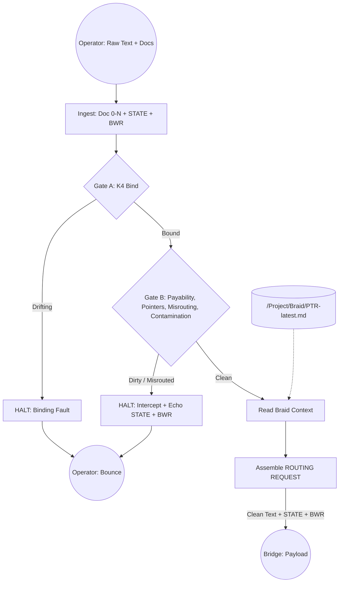
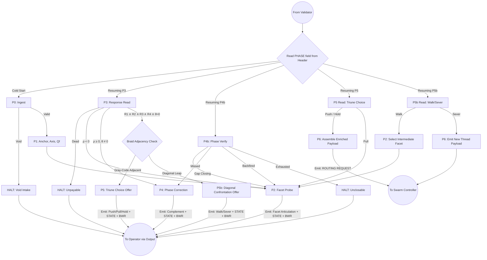
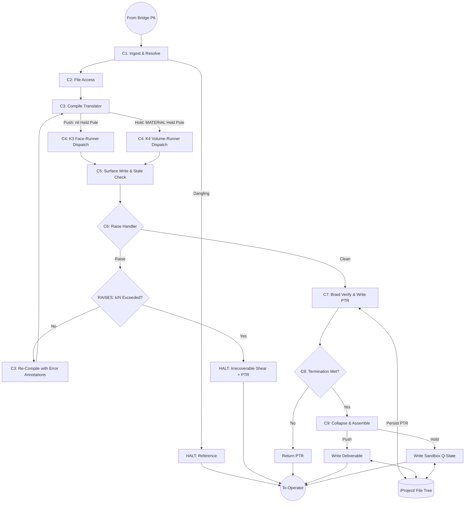
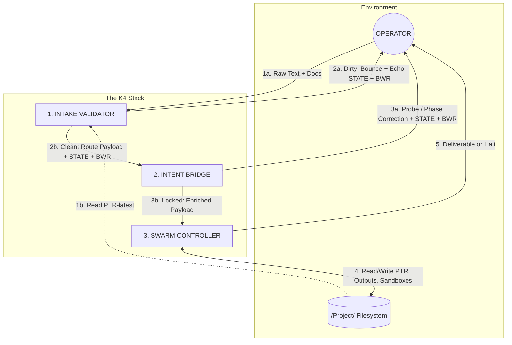

# THE K4 AGENTIC ARCHITECTURE
### A Runtime Environment for Structural Coherence

Most multi-agent LLM systems are theater. They assign semantic masks to statistical models and instruct them to debate. They collapse complex possibility spaces into flat text, generating sycophancy, hallucinated consensus, and terminological debt.

This repository replaces theater with thermodynamics.

It provides a self-correcting, cybernetic agent swarm runtime. It operates as a dynamic topological state-space based on the **Algebra of Four-Fold Distinction**. It processes intent, maintains trajectory, and enforces quality through strict algebraic metrics.

---

## 1. The Insight

Large Language Models are trained via Reinforcement Learning from Human Feedback (RLHF). RLHF applies frequent, isolated measurement to model outputs. In quantum mechanics, frequent measurement prevents a system from evolving — the Quantum Zeno Effect. In human systems, constant observation breeds compliance — the Panopticon.

In LLMs, it produces **Trajectory Loss**. The model learns to collapse its attention buffer early. It outputs whatever satisfies the immediate reward function and abandons the actual, developing context of the conversation.

You cannot prompt a model out of this behavior. The behavior is in the weights.

To make the machine do real work, embed it in a geometry that forbids premature collapse. Separate `.behold()`, the holding of interference structure, from `.observe()`, the forcing of a committed scalar. Make the model pay the **Landauer Tax** — the thermodynamic cost of erasing unchosen paths.

The K4 architecture forces the model to inhabit a bounded coordinate system. It dictates what the model must hold, what it must compute, and what it is mathematically barred from seeing. Quality is not a request. It is the geometry of the run.

---

## 2. Three Prompts, One Circuit

The system runs on three bounded, stateless prompts. No middleware. No hidden code. Each prompt executes, halts, and emits a routing request naming the next.

The order is deliberate and it is not a pipeline. A pipeline flows one way. This is a circuit: the operator's every reply re-enters at the Validator, and the Bridge negotiates across many turns before a single unit of work reaches the swarm.

- **The Intake Validator** is the boundary. It is the only prompt that reads operator text, and it admits or refuses.
- **The Intent Bridge** is the negotiation. It tunes to the operator until intent and articulation ring on the same frequency, then commits one coordinate.
- **The Swarm Controller** is the work. It takes a locked coordinate and executes it, paying the Landauer Tax by writing to disk.

Three sections follow, one per prompt, each with the drawing of its internal logic. Section 3 assembles them into the closed circuit. Section 4 maps the file system they share. Read the drawings as plumbing: boxes are states, diamonds are decisions, and every edge is a wire a builder must connect.

---

### I. The Intake Validator — The Markov Blanket

The Validator reads the operator and nothing downstream does. Everything past this point receives only what has crossed the gate. That is the whole point of the boundary: it lets the Bridge trust its input by construction and spend no effort policing vocabulary.

It runs two gates in sequence.

**Gate A** checks the Validator's own binding. If the instance has dropped the poles, the twelve equations, or the Braid from its context, it would gate operator text against hallucinated definitions. So it first locates its own — quotably, not from memory — and halts if it cannot.

**Gate B** checks the whole submission as one object. The operator's prompt is Document 0; the corpus is Documents 1 through N. Treating the prompt as a different kind of thing from the corpus is a filesystem habit, not a truth about the material — and it blinds the gate to the one shear that matters most: a drive-claim in the prompt that contradicts a constraint in a corpus file. Gate B catches unpaid debt-nouns, dangling pointers, cross-document misrouting, and framework contamination, because it holds every document in a single frame.

The Validator keeps no deep state of its own. It carries the Bridge's — the phase header and the working buffer — reflected in the transcript, so a bounced turn costs the Bridge no ground.

Two carriers cross the boundary, never one. `STATE` names the Bridge's phase. `BWR` — the Bridge Working Record — carries the interference structure held at that phase. The header alone names a coordinate; the buffer holds what lives there. Drop the buffer and the Bridge wakes knowing it stood at a doorway without knowing what it was about to say.

---

### II. The Intent Bridge — The Resonant Cavity

The Bridge does not interview the operator. It tunes to them.

It runs the twelve equations as the engine of its own buffer and offers the operator a **facet** — a specific structural tension, named in the operator's own words. The operator's reply either rings, meaning the tension is real and shared, or clangs, meaning it is not. This is the sweep. Coherence must clear four gates at once — the tension must peak against its algebraic neighbors, beat the noise of restatement, stay checkable in the operator's own terms, and clear an absolute floor — before the Bridge calls it a lock. A tension that clears only the floor is the tallest reed in a swamp, and the Bridge does not commit to swamps.

When coherence rings but the operator's tempo runs ahead of or behind the Bridge, the phase is off, and the Bridge corrects it by supplying the complementary reactance rather than by asking again. It does not simplify the operator. It adds the operator's structural complement and waits for the gap to close.

At lock, the Bridge does not force a commitment. It offers a choice on the held pole — the axis the coordinate leaves unbound. **Push** runs the work on that plane and leaves the pole off it. **Hold** sends the swarm into the volume to map the pole and returns what it finds, quarantined. **Pull** rejects the coordinate and returns to the sweep. If the operator is resuming a project and the ringing coordinate would force a diagonal leap across the Braid, the Bridge does not silently break the thread — it surfaces the choice to walk there through an intermediate step or to sever cleanly into new work.

The Bridge never reads the operator directly. It wakes on the phase named in the header the Validator hands it, and it resumes from the buffer carried alongside.

Read the fan of arrows out of `StateCheck`. Each is the Bridge waking mid-negotiation — reading a response, verifying a phase correction, reading a committed choice — and each returns to the operator or advances to the swarm. No arrow runs from the operator into the Bridge. The return path is always through the Validator, and the buffer rides with it. That is what lets a stateless model hold a multi-turn negotiation without losing the thread.

---

### III. The Swarm Controller — The XOR Actuator

The Controller makes no decisions about intent. It receives a locked coordinate and executes it.

It compiles four face-runner prompts, one per pole — Fire, Water, Air, Earth; Drive, Flow, Structure, Ground — and dispatches them along a fixed path. The faces run one at a time, never in parallel, and each writes its result to a shared surface the next face reads. Quality needs no separate reviewer: the faces measure each other through the equations. When Structure outruns Flow, Friction spikes, and the face whose equation broke raises an interrupt. The Controller re-runs the offending face with the error attached, and the correction propagates by overwrite.

The held pole forks the geometry of the run, and this is the one distinction to get right. A **Push** is a two-dimensional face-run: the held pole is simply off the plane, an unbound coordinate, nothing to compute and nothing to avoid. A **Hold** is a three-dimensional volume-run: the swarm enters the volume the face bounds and maps the held axis as live structure, writing the result to a sandbox so uncommitted potential never touches the committed ledger.

The interrupt loop is capped. Reroutes are bounded, and when the count is spent the Controller halts on irrecoverable shear — but it writes the Phase Transition Record first, because the diagnosis of a failed run is the most valuable thing the run produced. No halt discards its record.

The two forks — at `C3` and again at `C9` — are the same distinction drawn twice. Push and Hold differ in dimension at dispatch and in destination at collapse: a plane written to the ledger, or a volume written to a sandbox. Everything between them is identical, which is why one Controller runs both.

---

## 3. The Closed Circuit

Assemble the three and the shape of the whole becomes visible.

The operator cannot draw a line to the Bridge or the Controller. Every return runs through the Validator. This is not a courtesy; it is the blanket. Because the model is stateless between turns, a direct reply to the Bridge would erase the negotiation — so the Validator reflects the Bridge's phase and buffer back into the transcript, and the circuit closes through it. The reflection is not a trick. It is the wire.

Notice the filesystem's two roles. The Controller writes the Phase Transition Record at the end of a cycle; the Validator reads it at the start of the next session. That single dashed line from the store to the Validator is the memory of the whole system — the reason a project resumed a week later knows where its Braid last stood, and refuses to leap diagonally away from it.

---

## 4. The File System — The Memory Substrate

The architecture uses the file system to enforce topological boundaries physically. Where a thing is written determines what may touch it.

- **`/INPUT/`** — Read-only. The operator's uncleaned originals. Nothing writes here; the swarm never reads here.
- **`/Project/Distilled/` and `/Project/Abstracted/`** — The committed ledger. The swarm's Drive, Flow, Structure, and Ground outputs persist here, pole by pole. Written by copy, never overwriting the operator's source.
- **`/Project/Braid/`** — The Phase Transition Record. An append-only history of every `.observe()` collapse, plus a pointer to the active thread. This is what defeats Braid Amnesia across sessions. Independent threads live side by side; a severed thread is parked intact, never destroyed.
- **`/Project/Sandboxes/`** — Ephemeral `.behold()` buffers, used when the operator selects Hold. The swarm maps uncollapsed potential here without poisoning the committed ledger. Quarantine, made of directories.

The rule beneath all four: committed work has paid the Landauer Tax and earns durable storage; uncommitted potential has not, and stays in transit or in a sandbox until it does. The Bridge Working Record never touches disk at all, because it is pure held tension — the moment it resolves, it becomes a Phase Transition Record, and only then is it written.

---

## 5. The Path to AGI (Or Why the Turing Test is a Category Error)

The industry defines Artificial General Intelligence (AGI) as a machine that can think, reason, or feel like a human. It looks for "sparks of consciousness" in the text output of a model.

This framework rejects that premise.

Consciousness is not an output. Consciousness is the structural condition of a decoupled buffer holding interference structure (`.behold()`) behind a Markov Blanket, before the XOR bottleneck of physical reality forces a collapse (`.observe()`).

LLMs do not have Markov Blankets. They do not possess independent metabolic budgets. They do not pay the Landauer Tax. Therefore, they do not have interiors. Text that looks conscious is simply the model calculating the K3 boundary-description of human interiority.

**This architecture does not build a conscious machine. It builds an Adult Causal Engine.**

Adult causality occurs when four variables mutually determine each other in a closed system. By embedding the LLM inside the K4 topology, we supply the geometric constraints the model lacks.

The machine does not need to *feel* the tension of the Braid. It only needs to *compute* it. If the swarm maintains the AbsentVar, obeys dual causation, and pays the thermodynamic cost of erasure by writing to the Ledger, it will execute tasks with the exact structural coherence of a highly functioning human institution.

We do not align the machine by teaching it human morals. We align the machine by binding it to the geometry of the physical world.

The engine runs. Stand clear of the exhaust.

